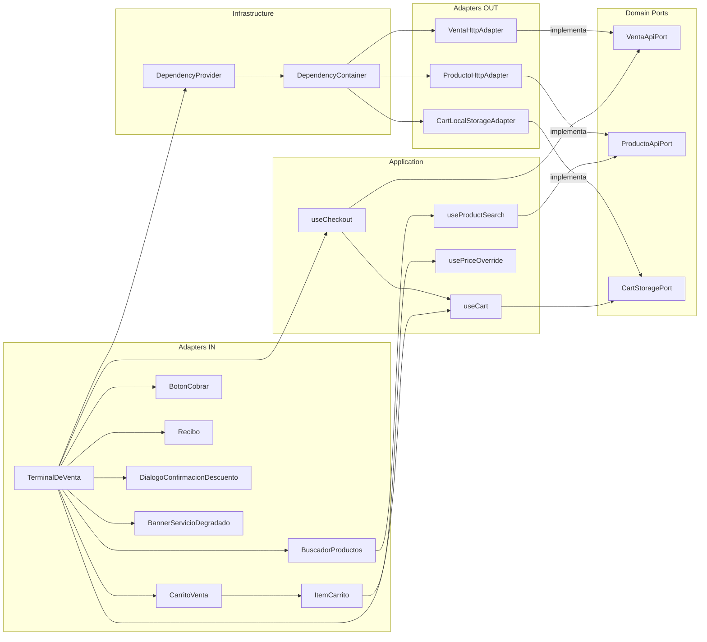
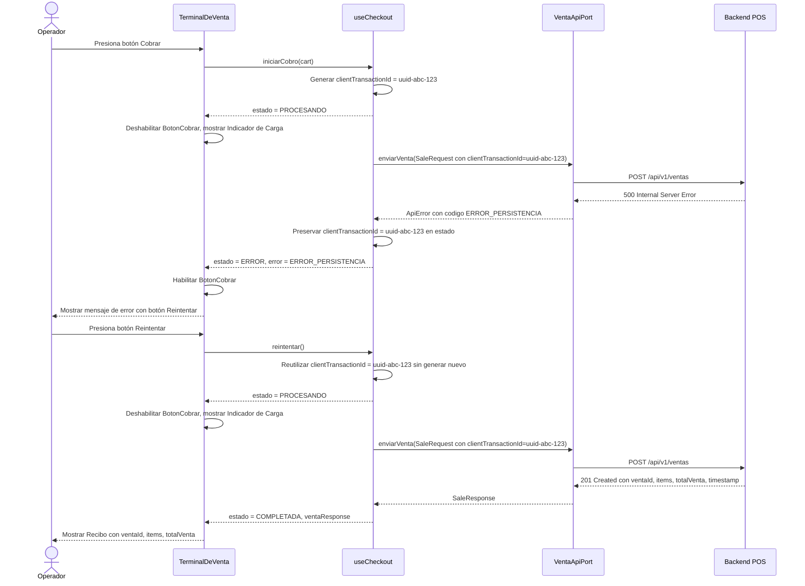

# Documento de Diseño Técnico — POS Frontend

## 1. Introducción

### Propósito

Este documento describe el diseño técnico del frontend web del sistema POS (Point of Sale). Define la arquitectura hexagonal, los modelos de dominio, los casos de uso, los componentes de interfaz, los adaptadores de salida y la estrategia de tests para una aplicación Next.js 14+ production-ready.

### Alcance

El diseño cubre exclusivamente la capa de presentación e interacción del sistema POS. No incluye lógica de inventario, autenticación de usuarios ni reportes. El frontend consume dos endpoints REST del backend POS y toda la lógica de negocio del carrito reside en la capa de dominio del frontend.

### Tecnologías

| Tecnología | Versión | Rol |
|---|---|---|
| Next.js | 14+ | Framework React con App Router, SSR y routing |
| TypeScript | 5+ (strict: true) | Tipado estático, sin any implícito |
| Tailwind CSS | 3+ | Estilos utilitarios |
| React Hook Form | 7+ | Gestión de formularios con validación |
| Zod | 3+ | Esquemas de validación y parsing |
| TanStack Query | 5+ | Caché y sincronización de estado del servidor |
| Vitest | 1+ | Runner de tests unitarios y de propiedades |
| Testing Library | 14+ | Tests de componentes React |
| fast-check | 3+ | Property-Based Testing |


## 2. Arquitectura General

El frontend sigue una arquitectura hexagonal (Ports and Adapters) organizada en cuatro capas. La regla fundamental es que las dependencias apuntan siempre hacia el dominio: el dominio no conoce ninguna capa externa.

`mermaid
graph TD
    subgraph Adapters_IN
        UI[Componentes React / Paginas Next.js App Router]
    end
    subgraph Application
        UC[Casos de Uso / Hooks React / Funciones puras]
    end
    subgraph Domain
        TYPES[Tipos puros / Reglas de negocio]
        PORTS[Interfaces de Puertos: VentaApiPort / ProductoApiPort / CartStoragePort]
        LOGIC[Logica pura: cartCalculations / cartOperations / priceValidation]
    end
    subgraph Adapters_OUT
        HTTP[VentaHttpAdapter / ProductoHttpAdapter]
        STORAGE[CartLocalStorageAdapter]
    end
    subgraph Infrastructure
        DI[DependencyContainer / DependencyProvider]
    end
    UI --> UC
    UC --> PORTS
    UC --> LOGIC
    HTTP --> PORTS
    STORAGE --> PORTS
    DI --> HTTP
    DI --> STORAGE
    DI --> UI
`

### Descripción de Capas

**`src/domain/`** — Núcleo de la aplicación. Contiene tipos TypeScript puros, reglas de negocio como funciones puras e interfaces de puertos. No tiene ninguna dependencia de React, Next.js, fetch, localStorage ni ninguna librería externa. Es completamente testeable sin infraestructura.

**`src/application/`** — Casos de uso implementados como hooks React o funciones puras. Orquestan la lógica del dominio y se comunican con el exterior exclusivamente a través de las interfaces de puertos. Dependen del dominio pero no de los adaptadores concretos.

**`src/adapters/in/`** — Componentes React y páginas Next.js App Router. Son la interfaz de usuario que el operador ve e interactúa. Consumen los casos de uso de la capa de aplicación. No importan directamente ningún adaptador de salida.

**`src/adapters/out/`** — Implementaciones concretas de los puertos del dominio. Contienen las llamadas `fetch` al backend y el acceso a `localStorage`. Son intercambiables sin modificar el dominio ni la aplicación.

**Regla de dependencias:** El dominio no importa nada de las capas externas. Los adaptadores de entrada y salida dependen del dominio a través de sus interfaces. La inyección de dependencias conecta las implementaciones concretas con los casos de uso en tiempo de ejecución.


## 3. Estructura de Carpetas

```
src/
├── domain/
│   ├── types/
│   │   ├── Cart.ts              Tipos CartItem, Cart, CartState
│   │   ├── Product.ts           Tipo Product con productoId y precioUnitario
│   │   ├── Sale.ts              Tipos SaleRequest, SaleResponse, SaleItem, SaleRequestItem
│   │   └── Errors.ts            Tipos ApiError, DomainError, enum ErrorCode
│   ├── ports/
│   │   ├── VentaApiPort.ts      Interfaz para enviar ventas al backend
│   │   ├── ProductoApiPort.ts   Interfaz para consultar precios de productos
│   │   └── CartStoragePort.ts   Interfaz para persistir y recuperar el carrito
│   └── logic/
│       ├── cartCalculations.ts  Funciones: calcularSubtotal, calcularTotal, redondeoHalfUp
│       ├── cartOperations.ts    Funciones: agregarItem, quitarItem, actualizarCantidad, deduplicar
│       ├── priceValidation.ts   Funciones: calcularUmbralDescuento, validarPrecioOverride
│       └── transactionId.ts     Función: generarClientTransactionId (UUID v4)
├── application/
│   ├── useCart.ts               Hook que orquesta todas las operaciones del carrito
│   ├── useProductSearch.ts      Hook para buscar producto y obtener precio vía ProductoApiPort
│   ├── useCheckout.ts           Hook para el proceso de cobro vía VentaApiPort
│   └── usePriceOverride.ts      Hook para gestionar precio override por ítem del carrito
├── adapters/
│   ├── in/
│   │   ├── components/
│   │   │   ├── TerminalDeVenta/          Componente raíz de la pantalla principal de venta
│   │   │   ├── BuscadorProductos/        Búsqueda y consulta de precio de producto
│   │   │   ├── CarritoVenta/             Lista de ítems con subtotales y total
│   │   │   ├── ItemCarrito/              Fila de ítem con cantidad y campo de precio override
│   │   │   ├── BotonCobrar/              Botón con estado de carga y deshabilitado
│   │   │   ├── Recibo/                   Pantalla de confirmación tras venta exitosa
│   │   │   ├── DialogoConfirmacionDescuento/  Modal de confirmación para override menor al 70%
│   │   │   └── BannerServicioDegradado/  Banner de error 503 fijo en la parte superior
│   │   └── pages/
│   │       └── app/page.tsx              Página principal Next.js App Router
│   └── out/
│       ├── VentaHttpAdapter.ts           Implementa VentaApiPort con fetch
│       ├── ProductoHttpAdapter.ts        Implementa ProductoApiPort con fetch
│       └── CartLocalStorageAdapter.ts    Implementa CartStoragePort con localStorage
└── infrastructure/
    └── di/
        └── DependencyContainer.ts        Configuración de inyección de dependencias
```


## 4. Modelo de Dominio

### 4.1 Tipos del Carrito

**`CartItem`** — Representa un producto dentro del carrito de venta. Campos:
- `productoId`: identificador único del producto (ej. `PROD-001`)
- `nombreProducto`: nombre descriptivo del producto para mostrar en la UI
- `precioOficial`: precio unitario vigente según el backend
- `cantidad`: número de unidades del producto en el carrito (entero positivo)
- `precioOverride` (opcional): precio alternativo ingresado manualmente por el operador
- `autorizadoPor` (opcional): identificador del supervisor que autoriza el precio override; obligatorio cuando precioOverride está presente
- `precioAplicado`: precio unitario efectivamente usado para calcular el subtotal; es precioOverride si fue ingresado, de lo contrario es precioOficial
- `subtotal`: resultado de precioAplicado multiplicado por cantidad, redondeado HALF_UP a 2 decimales
- `errorCodigo` (opcional): código de error del backend asociado a este ítem (ej. STOCK_INSUFICIENTE); presente cuando el backend rechaza el ítem

**`Cart`** — Estructura principal del carrito de venta. Campos:
- `items`: arreglo de CartItem que componen la venta actual
- `total`: suma de todos los subtotales, redondeada HALF_UP a 2 decimales
- `clientTransactionId` (opcional): UUID v4 generado al iniciar el cobro; se preserva durante reintentos

**`CartState`** — Estado de la sesión de venta. Valores posibles: `IDLE`, `PROCESANDO`, `COMPLETADA`, `ERROR`.

### 4.2 Tipos de Producto

**`Product`** — Entidad de producto devuelta por el backend. Campos:
- `productoId`: identificador único del producto
- `precioUnitario`: precio oficial vigente del producto

### 4.3 Tipos de Venta

**`SaleRequestItem`** — Ítem dentro de una solicitud de venta al backend. Campos:
- `productoId`: identificador del producto
- `cantidad`: número de unidades
- `precioOverride` (opcional): precio alternativo autorizado
- `autorizadoPor` (opcional): identificador del autorizador del precio override

**`SaleRequest`** — Cuerpo de la solicitud POST /api/v1/ventas. Campos:
- `clientTransactionId` (opcional): UUID v4 para idempotencia
- `items`: arreglo de SaleRequestItem

**`SaleItem`** — Ítem dentro de la respuesta de venta del backend. Campos:
- `productoId`: identificador del producto
- `cantidad`: unidades vendidas
- `precioUnitario`: precio oficial del producto
- `precioAplicado`: precio efectivamente cobrado
- `subtotal`: monto del ítem en la venta

**`SaleResponse`** — Respuesta del backend tras una venta exitosa. Campos:
- `ventaId`: identificador único de la venta generado por el backend
- `clientTransactionId` (opcional): UUID v4 devuelto por el backend para confirmación de idempotencia
- `estado`: estado de la venta (ej. `COMPLETADA`)
- `items`: arreglo de SaleItem con los detalles de cada producto vendido
- `totalVenta`: monto total de la venta
- `timestamp`: fecha y hora de la venta en formato ISO 8601

### 4.4 Tipos de Error

**`ErrorCode`** — Enumeración de códigos de error del sistema. Valores:
- `STOCK_INSUFICIENTE`: el backend no tiene suficiente stock del producto
- `PRODUCTO_NO_ENCONTRADO`: el producto no existe en el sistema del backend
- `PRECIO_FUERA_DE_RANGO`: el precio override está fuera del rango permitido por el backend
- `SERVICIO_STOCK_NO_DISPONIBLE`: el servicio de stock del backend no está disponible (503)
- `ERROR_PERSISTENCIA`: error interno del backend al persistir la venta (500)
- `VALIDACION_FALLIDA`: la solicitud no pasó la validación del backend (400)
- `ERROR_RED`: error de conectividad de red entre el frontend y el backend

**`ApiError`** — Error estructurado devuelto por el backend o generado por el adaptador HTTP. Campos:
- `codigo`: valor del enum ErrorCode
- `mensaje`: descripción legible del error para mostrar al operador
- `campo` (opcional): identificador del campo o ítem afectado (ej. productoId del ítem con error)

**`DomainError`** — Error de validación generado en la capa de dominio antes de llamar al backend. Campos:
- `codigo`: valor del enum ErrorCode
- `mensaje`: descripción del error de validación

### 4.5 Reglas de Negocio del Dominio

Las siguientes reglas son invariantes que deben cumplirse en todo momento:

- **Precio aplicado:** `precioAplicado = precioOverride ?? precioOficial`
- **Subtotal:** `subtotal = redondeoHalfUp(precioAplicado × cantidad, 2)`
- **Total:** `total = redondeoHalfUp(suma(subtotales de todos los ítems), 2)`
- **Umbral de descuento:** `umbralDescuento = redondeoHalfUp(precioOficial × 0.70, 2)`
- **Override bajo umbral:** `overrideBajoUmbral = (precioOverride < umbralDescuento)`
- **Override válido:** `precioOverride > 0` cuando está presente
- **Deduplicación:** no pueden existir dos CartItem con el mismo productoId en el mismo carrito
- **Redondeo:** todos los cálculos monetarios usan HALF_UP con precisión de 2 decimales


## 5. Puertos (Interfaces del Dominio)

Los puertos son interfaces TypeScript puras definidas en `src/domain/ports/`. No contienen ninguna referencia a implementaciones concretas, librerías de red, APIs del navegador ni módulos de React o Next.js.

### 5.1 VentaApiPort

Abstrae el envío de una venta al backend.

```
enviarVenta(request: SaleRequest): Promise<SaleResponse>
  - Recibe: SaleRequest con clientTransactionId opcional e items
  - Devuelve: Promise que resuelve con SaleResponse en caso de éxito
  - Lanza: ApiError con el código correspondiente en caso de error HTTP o de red
```

### 5.2 ProductoApiPort

Abstrae la consulta del precio oficial de un producto.

```
consultarPrecio(productoId: string): Promise<Product>
  - Recibe: productoId como string
  - Devuelve: Promise que resuelve con Product (productoId + precioUnitario)
  - Lanza: ApiError con código PRODUCTO_NO_ENCONTRADO (404), VALIDACION_FALLIDA (400) o ERROR_RED
```

### 5.3 CartStoragePort

Abstrae la persistencia local del carrito entre sesiones y recargas de página.

```
guardar(cart: Cart): void
  - Recibe: Cart completo con items y total
  - Efecto: persiste el carrito en el almacenamiento local
  - En entorno SSR: no-op (no lanza error)

recuperar(): Cart | null
  - Devuelve: Cart previamente guardado, o null si no existe o el formato es inválido
  - En entorno SSR: devuelve null

limpiar(): void
  - Efecto: elimina el carrito del almacenamiento local
  - En entorno SSR: no-op
```


## 6. Casos de Uso (Application Layer)

### 6.1 useCart

Hook React que orquesta todas las operaciones del carrito. Recibe CartStoragePort y las funciones de dominio como dependencias inyectadas.

**Algoritmo:**

1. Al montar el componente, invocar `CartStoragePort.recuperar()` para restaurar el carrito desde el almacenamiento local. Si devuelve null, inicializar con carrito vacío.
2. **agregarItem(productoId, nombreProducto, precioOficial, cantidad):**
   a. Buscar en el estado actual si ya existe un CartItem con ese productoId.
   b. Si existe: invocar `actualizarCantidad(productoId, existente.cantidad + cantidad)`.
   c. Si no existe: crear nuevo CartItem con precioAplicado = precioOficial, calcular subtotal con `redondeoHalfUp(precioOficial × cantidad, 2)`.
   d. Recalcular el total del carrito.
   e. Persistir el nuevo estado en CartStoragePort.
3. **quitarItem(productoId):**
   a. Filtrar el arreglo de items eliminando el ítem con ese productoId.
   b. Recalcular el total.
   c. Persistir en CartStoragePort.
4. **actualizarCantidad(productoId, nuevaCantidad):**
   a. Si nuevaCantidad > 0: actualizar la cantidad del ítem y recalcular su subtotal.
   b. Si nuevaCantidad = 0: invocar quitarItem(productoId).
   c. Recalcular el total del carrito.
   d. Persistir en CartStoragePort.
5. **actualizarPrecioOverride(productoId, precioOverride, autorizadoPor):**
   a. Localizar el CartItem con ese productoId.
   b. Actualizar precioOverride y autorizadoPor en el ítem.
   c. Recalcular precioAplicado = precioOverride ?? precioOficial.
   d. Recalcular subtotal = redondeoHalfUp(precioAplicado × cantidad, 2).
   e. Recalcular el total del carrito.
   f. Persistir en CartStoragePort.
6. **vaciarCarrito():**
   a. Establecer items = [] y total = 0.
   b. Invocar CartStoragePort.limpiar().
7. Tras cada operación que modifica el estado, persistir automáticamente en CartStoragePort.

**Estado expuesto:** `{ cart, agregarItem, quitarItem, actualizarCantidad, actualizarPrecioOverride, vaciarCarrito }`

### 6.2 useProductSearch

Hook React para buscar un producto y obtener su precio oficial. Recibe ProductoApiPort como dependencia inyectada.

**Algoritmo:**

1. Mantener estado interno: `{ query, resultado, cargando, error }`.
2. **buscar(productoId):**
   a. Validar el formato de productoId con Zod (alfanumérico con guiones) antes de llamar al backend.
   b. Si el formato es inválido: establecer error con mensaje "Formato de ID inválido" sin invocar ProductoApiPort.
   c. Si el formato es válido: establecer cargando = true, limpiar error y resultado previo.
   d. Invocar `ProductoApiPort.consultarPrecio(productoId)`.
   e. En éxito: establecer resultado con el Product devuelto, cargando = false.
   f. En error 404: establecer error con mensaje "Producto no encontrado", cargando = false.
   g. En error 400: establecer error con mensaje "Formato de ID inválido", cargando = false.
   h. En error 500 o error de red: establecer error con mensaje "Error al consultar precio. Intente nuevamente." y flag `puedeReintentar = true`, cargando = false.
3. **limpiar():** restablecer todo el estado a valores iniciales.

**Estado expuesto:** `{ query, resultado, cargando, error, puedeReintentar, buscar, limpiar }`

### 6.3 useCheckout

Hook React para el proceso de cobro. Recibe VentaApiPort y useCart como dependencias.

**Algoritmo:**

1. Mantener estado interno: `{ estado, error, ventaResponse, clientTransactionId }`.
2. **iniciarCobro(cart):**
   a. Verificar que cart.items no esté vacío; si está vacío, no proceder.
   b. Verificar que todos los ítems con precioOverride tengan autorizadoPor no vacío; si alguno falta, establecer error con mensaje "Se requiere autorización para el precio modificado" y referenciar el productoId afectado.
   c. Identificar ítems con overrideBajoUmbral (precioOverride < umbralDescuento). Si existen, devolver estado `REQUIERE_CONFIRMACION` con la lista de ítems afectados para que el componente muestre el diálogo.
   d. Invocar `confirmarCobro(cart)` directamente si no hay ítems bajo umbral.
3. **confirmarCobro(cart):**
   a. Si no existe clientTransactionId en el estado (primer intento): generar nuevo UUID v4 con `generarClientTransactionId()` y guardarlo en el estado.
   b. Si ya existe clientTransactionId (reintento): reutilizar el existente.
   c. Establecer estado = PROCESANDO.
   d. Construir SaleRequest mapeando cada CartItem a SaleRequestItem (productoId, cantidad, precioOverride?, autorizadoPor?).
   e. Invocar `VentaApiPort.enviarVenta(request)`.
   f. En éxito (201 o 200): establecer estado = COMPLETADA, guardar ventaResponse, invocar `vaciarCarrito()`.
   g. En error 422: mapear el campo del ApiError al CartItem afectado, establecer errorCodigo en ese ítem, establecer estado = ERROR.
   h. En error 503: establecer estado = ERROR con código SERVICIO_STOCK_NO_DISPONIBLE, activar bannerServicioDegradado.
   i. En error 500 o error de red: establecer estado = ERROR, preservar clientTransactionId para reintento.
4. **reintentar():** invocar confirmarCobro con el carrito actual, reutilizando el clientTransactionId existente.
5. **resetear():** limpiar estado, error, ventaResponse y clientTransactionId.

**Estado expuesto:** `{ estado, error, ventaResponse, bannerServicioDegradado, iniciarCobro, confirmarCobro, reintentar, resetear }`

### 6.4 usePriceOverride

Hook o función pura para calcular el estado de un precio override para un ítem específico.

**Algoritmo:**

1. Recibir `productoId`, `precioOverride` y `precioOficial` como parámetros.
2. Calcular `umbralDescuento = redondeoHalfUp(precioOficial × 0.70, 2)`.
3. Determinar `overrideBajoUmbral = (precioOverride < umbralDescuento)`.
4. Determinar `precioAplicado = precioOverride ?? precioOficial`.
5. Determinar `requiereConfirmacion = overrideBajoUmbral && precioOverride !== undefined`.
6. Devolver `{ precioAplicado, umbralDescuento, overrideBajoUmbral, requiereConfirmacion }`.


## 7. Componentes (Adapters In)

### 7.1 TerminalDeVenta

Componente raíz de la pantalla principal de venta. Compone todos los subcomponentes y provee el contexto de dependencias.

**Responsabilidades:**
- Componer BuscadorProductos, CarritoVenta, BotonCobrar y los diálogos/banners.
- Proveer el DependencyProvider con las implementaciones concretas de los puertos.
- Gestionar el estado global de la sesión: `EstadoCobro` con valores `IDLE | PROCESANDO | COMPLETADA | ERROR`.
- Coordinar la transición entre la vista del carrito y la vista del Recibo.
- Mostrar u ocultar DialogoConfirmacionDescuento y BannerServicioDegradado según el estado.

**Props:** ninguna (es la página raíz).

### 7.2 BuscadorProductos

Componente para buscar un producto por su ID y agregarlo al carrito.

**Props:**
- `onProductoAgregado(item: CartItem)`: callback invocado cuando el operador confirma la adición del producto al carrito.

**Estado interno:** query de búsqueda, resultado del producto, estado de carga, mensaje de error, flag de puede reintentar.

**Comportamiento:**
- Consume `useProductSearch` para la consulta al backend.
- Muestra el Indicador_de_Carga mientras la consulta está en curso y deshabilita el campo de búsqueda.
- Muestra el nombre del producto, el Precio_Oficial y un campo de cantidad (valor predeterminado: 1) tras una respuesta exitosa.
- Muestra mensajes de error específicos según el código de error recibido.
- Al confirmar la adición, invoca `onProductoAgregado` y limpia el estado interno para una nueva búsqueda.
- Valida el formato del productoId localmente con Zod antes de invocar el puerto.

### 7.3 CarritoVenta

Componente que muestra la lista de ítems del carrito con subtotales y el total de la venta.

**Props:**
- `items`: arreglo de CartItem a mostrar.
- `total`: monto total de la venta con 2 decimales.
- `onActualizarCantidad(productoId, nuevaCantidad)`: callback para cambiar la cantidad de un ítem.
- `onEliminarItem(productoId)`: callback para eliminar un ítem del carrito.
- `onActualizarOverride(productoId, precioOverride, autorizadoPor)`: callback para actualizar el precio override de un ítem.

**Comportamiento:**
- Renderiza un ItemCarrito por cada elemento del arreglo items.
- Muestra el total formateado con exactamente 2 decimales.
- Si items está vacío, muestra un mensaje indicando que el carrito está vacío.

### 7.4 ItemCarrito

Componente que representa una fila del carrito para un producto específico.

**Props:**
- `item`: CartItem con todos sus campos.
- `onActualizarCantidad(productoId, nuevaCantidad)`: callback para cambiar la cantidad.
- `onEliminar(productoId)`: callback para eliminar el ítem.
- `onActualizarOverride(productoId, precioOverride, autorizadoPor)`: callback para actualizar el precio override.

**Comportamiento:**
- Muestra productoId, nombreProducto, precioOficial, cantidad, precioAplicado y subtotal.
- Incluye un campo opcional de precioOverride. Cuando el operador ingresa un valor, muestra el campo autorizadoPor como obligatorio.
- Aplica resaltado visual (borde o fondo de color de advertencia) cuando item.errorCodigo está presente.
- Muestra el mensaje de error correspondiente al errorCodigo junto al ítem afectado.
- Muestra advertencia visual cuando precioOverride está por debajo del umbral del 70%.

### 7.5 BotonCobrar

Componente de responsabilidad única: renderizar el botón de cobro con el estado correcto.

**Props:**
- `disabled`: booleano que deshabilita el botón (carrito vacío o cobro en proceso).
- `cargando`: booleano que muestra el Indicador_de_Carga dentro del botón.
- `onClick`: callback invocado al presionar el botón.

**Comportamiento:**
- Cuando `disabled` es true, el botón no responde a clics.
- Cuando `cargando` es true, muestra un indicador de carga y el texto cambia a "Procesando...".
- Incluye `aria-busy` cuando cargando es true y `aria-label` descriptivo en todo momento.

### 7.6 Recibo

Componente que muestra el resumen de una venta completada exitosamente.

**Props:**
- `ventaId`: identificador de la venta generado por el backend.
- `items`: arreglo de SaleItem con los detalles de cada producto vendido.
- `totalVenta`: monto total de la venta.
- `timestamp`: fecha y hora de la venta.
- `onNuevaVenta()`: callback invocado al presionar el botón "Nueva Venta".

**Comportamiento:**
- Muestra ventaId, timestamp, lista de ítems con cantidades y precios aplicados, y totalVenta.
- El botón "Nueva Venta" invoca onNuevaVenta, que vacía el carrito y regresa a la Terminal_de_Venta en estado IDLE.

### 7.7 DialogoConfirmacionDescuento

Modal de confirmación que se muestra cuando hay ítems con precio override inferior al umbral del 70%.

**Props:**
- `itemsAfectados`: arreglo de CartItem con overrideBajoUmbral = true.
- `onConfirmar()`: callback invocado cuando el operador confirma el cobro con los descuentos.
- `onCancelar()`: callback invocado cuando el operador cancela y regresa al carrito.

**Comportamiento:**
- Lista cada ítem afectado con su productoId, precioOficial, precioOverride y el porcentaje de descuento.
- Requiere que el operador presione explícitamente el botón "Confirmar" para proceder.
- Al presionar "Cancelar", cierra el diálogo sin enviar ninguna solicitud al backend.
- Soporta cierre con la tecla Escape (invoca onCancelar).
- Trampa el foco dentro del diálogo mientras está abierto (accesibilidad).

### 7.8 BannerServicioDegradado

Banner informativo fijo en la parte superior de la pantalla cuando el servicio de stock no está disponible.

**Props:**
- `visible`: booleano que controla si el banner se muestra.
- `mensaje`: texto descriptivo del estado degradado.

**Comportamiento:**
- Cuando visible es true, se muestra con `role="alert"` para notificar a lectores de pantalla.
- Se oculta automáticamente cuando el backend responde exitosamente en un reintento.
- No bloquea la interacción con el resto de la pantalla.


## 8. Adaptadores de Salida

### 8.1 VentaHttpAdapter

Implementa `VentaApiPort`. Contiene toda la lógica de comunicación HTTP con el endpoint de ventas.

**Método `enviarVenta(request: SaleRequest): Promise<SaleResponse>`:**

Realiza `POST /api/v1/ventas` con el cuerpo serializado como JSON. Mapeo de respuestas HTTP:

| Código HTTP | Acción |
|---|---|
| 201 Created | Deserializar cuerpo como SaleResponse y resolver la Promise |
| 200 OK | Deserializar cuerpo como SaleResponse (respuesta idempotente) y resolver la Promise |
| 400 Bad Request | Rechazar con ApiError { codigo: VALIDACION_FALLIDA, mensaje: "Solicitud inválida. Revise los datos del carrito." } |
| 422 Unprocessable Entity | Leer el cuerpo del error, extraer el código y campo, rechazar con ApiError { codigo: código del body, campo: campo del body } |
| 503 Service Unavailable | Rechazar con ApiError { codigo: SERVICIO_STOCK_NO_DISPONIBLE, mensaje: "Servicio de stock no disponible. Contacte al administrador." } |
| 500 Internal Server Error | Rechazar con ApiError { codigo: ERROR_PERSISTENCIA, mensaje: "Error al procesar la venta. Puede reintentar de forma segura." } |
| Error de red (fetch falla) | Rechazar con ApiError { codigo: ERROR_RED, mensaje: "Error de conexión. Verifique su red." } |

### 8.2 ProductoHttpAdapter

Implementa `ProductoApiPort`. Contiene la lógica de comunicación HTTP con el endpoint de precios.

**Método `consultarPrecio(productoId: string): Promise<Product>`:**

Realiza `GET /api/v1/productos/{productoId}/precio`. Mapeo de respuestas HTTP:

| Código HTTP | Acción |
|---|---|
| 200 OK | Deserializar cuerpo como Product { productoId, precioUnitario } y resolver la Promise |
| 404 Not Found | Rechazar con ApiError { codigo: PRODUCTO_NO_ENCONTRADO, mensaje: "Producto no encontrado" } |
| 400 Bad Request | Rechazar con ApiError { codigo: VALIDACION_FALLIDA, mensaje: "Formato de ID inválido" } |
| 500 Internal Server Error | Rechazar con ApiError { codigo: ERROR_RED, mensaje: "Error al consultar precio. Intente nuevamente." } |
| Error de red (fetch falla) | Rechazar con ApiError { codigo: ERROR_RED, mensaje: "Error al consultar precio. Intente nuevamente." } |

### 8.3 CartLocalStorageAdapter

Implementa `CartStoragePort`. Gestiona la persistencia del carrito en el almacenamiento local del navegador.

**Clave de almacenamiento:** `pos_cart`

**Método `guardar(cart: Cart): void`:**
- Si `typeof window === 'undefined'` (entorno SSR): no-op, retorna sin error.
- Serializar el Cart completo como JSON.
- Almacenar en `localStorage` bajo la clave `pos_cart`.

**Método `recuperar(): Cart | null`:**
- Si `typeof window === 'undefined'` (entorno SSR): devolver null.
- Leer el valor de `localStorage` bajo la clave `pos_cart`.
- Si no existe o es null: devolver null.
- Intentar deserializar el JSON. Si la deserialización falla o el formato es inválido: devolver null (no lanzar error).
- Devolver el Cart deserializado.

**Método `limpiar(): void`:**
- Si `typeof window === 'undefined'` (entorno SSR): no-op.
- Eliminar la clave `pos_cart` de `localStorage`.


## 9. Inyección de Dependencias

### Patrón utilizado: React Context como contenedor de dependencias

El sistema utiliza React Context para proveer las implementaciones concretas de los puertos a los casos de uso y componentes. Este patrón permite sustituir las implementaciones reales por simuladas en los tests sin modificar ningún archivo fuera de la configuración de inyección.

### DependencyContainer

Módulo en `src/infrastructure/di/DependencyContainer.ts` que crea y exporta las instancias concretas de los adaptadores:

- Instancia de `VentaHttpAdapter` que implementa `VentaApiPort`
- Instancia de `ProductoHttpAdapter` que implementa `ProductoApiPort`
- Instancia de `CartLocalStorageAdapter` que implementa `CartStoragePort`

El contenedor no tiene lógica de ciclo de vida; simplemente instancia los adaptadores con sus configuraciones (URL base del backend, etc.).

### DependencyProvider

Componente React que envuelve la aplicación y provee el contexto con las implementaciones concretas. Se ubica en el nivel más alto del árbol de componentes (en `app/layout.tsx` o en `TerminalDeVenta`).

El contexto expone: `{ ventaApi: VentaApiPort, productoApi: ProductoApiPort, cartStorage: CartStoragePort }`.

### Consumo en casos de uso

Los hooks de la capa de aplicación (`useCart`, `useProductSearch`, `useCheckout`, `usePriceOverride`) consumen el contexto de dependencias mediante un hook personalizado `useDependencies()`. Nunca importan directamente los adaptadores concretos.

### MockDependencyProvider para tests

En los tests de componentes e integración, se provee un `MockDependencyProvider` que acepta implementaciones simuladas de los tres puertos. Las implementaciones simuladas son objetos que implementan las interfaces de los puertos sin usar librerías de mocking que generen tipos `any`.

```
MockDependencyProvider:
  Props:
    - ventaApi: VentaApiPort (implementación simulada)
    - productoApi: ProductoApiPort (implementación simulada)
    - cartStorage: CartStoragePort (implementación simulada)
    - children: ReactNode
```


## 10. Diagrama de Componentes




## 11. Diagrama de Secuencia — Flujo de Cobro Exitoso

```mermaid
sequenceDiagram
    actor Operador
    participant TDV as TerminalDeVenta
    participant UCO as useCheckout
    participant DCD as DialogoConfirmacionDescuento
    participant VAP as VentaApiPort
    participant Backend as Backend POS
    participant UC as useCart
    participant REC as Recibo

    Operador->>TDV: Presiona botón Cobrar
    TDV->>UCO: iniciarCobro(cart)
    UCO->>UCO: Verificar carrito no vacío
    UCO->>UCO: Verificar autorizadoPor en ítems con override
    UCO->>UCO: Identificar ítems con override bajo umbral

    alt Hay ítems con override bajo umbral
        UCO-->>TDV: estado = REQUIERE_CONFIRMACION, itemsAfectados
        TDV->>DCD: Mostrar diálogo con itemsAfectados
        Operador->>DCD: Presiona Confirmar
        DCD-->>TDV: onConfirmar()
        TDV->>UCO: confirmarCobro(cart)
    else No hay ítems bajo umbral
        UCO->>UCO: confirmarCobro(cart)
    end

    UCO->>UCO: Generar clientTransactionId UUID v4
    UCO-->>TDV: estado = PROCESANDO
    TDV->>TDV: Deshabilitar BotonCobrar, mostrar Indicador de Carga
    UCO->>UCO: Construir SaleRequest desde CartItem[]
    UCO->>VAP: enviarVenta(SaleRequest)
    VAP->>Backend: POST /api/v1/ventas
    Backend-->>VAP: 201 Created con ventaId, items, totalVenta, timestamp
    VAP-->>UCO: SaleResponse
    UCO->>UC: vaciarCarrito()
    UC->>UC: items = [], total = 0
    UC->>UC: CartStoragePort.limpiar()
    UCO-->>TDV: estado = COMPLETADA, ventaResponse
    TDV->>REC: Mostrar Recibo con ventaId, items, totalVenta, timestamp
    Operador->>REC: Presiona Nueva Venta
    REC-->>TDV: onNuevaVenta()
    TDV-->>Operador: Terminal de Venta en estado IDLE con carrito vacío
```




## 12. Diagrama de Secuencia — Flujo de Error con Reintento




## 13. Propiedades de Corrección

*Una propiedad es una característica o comportamiento que debe cumplirse en todas las ejecuciones válidas de un sistema; es decir, una declaración formal sobre lo que el sistema debe hacer. Las propiedades sirven como puente entre las especificaciones legibles por humanos y las garantías de corrección verificables por máquina.*

El análisis de los criterios de aceptación identifica las siguientes propiedades universales verificables mediante property-based testing con fast-check. Se aplica PBT porque el dominio contiene funciones puras de cálculo monetario, transformaciones de datos y lógica de validación donde la variación de inputs revela casos borde que los tests de ejemplo no cubren.

**Reflexión sobre redundancia:**

Tras revisar todas las propiedades identificadas en el prework:
- Las propiedades 1.2 y 7.5 (deduplicación) son equivalentes; se consolidan en una sola.
- Las propiedades 1.6 y 7.4 (redondeo a 2 decimales) se consolidan: la propiedad de subtotal ya implica el límite de 2 decimales.
- Las propiedades 1.7 y 7.1 (total = suma de subtotales) son idénticas; se mantiene una.
- La propiedad 7.2 (idempotencia del cálculo) es independiente y se mantiene.
- La propiedad 7.3 (umbral = 70% redondeado) es independiente y se mantiene.
- La propiedad 7.6 (total >= 0) es independiente y se mantiene.
- Las propiedades de precioAplicado (4.8) y validación de override (4.3, 4.9) son independientes.
- La propiedad de idempotencia del clientTransactionId (3.3, 5.6) se consolida en una.
- La propiedad de round-trip de CartStorage (1.10) es independiente.

Resultado: 9 propiedades únicas tras la consolidación.

---

### Propiedad 1: Consistencia del total con la suma de subtotales

*Para cualquier* carrito con cualquier combinación arbitraria de ítems (productoId, cantidad, precioAplicado), el total calculado del carrito debe ser exactamente igual a la suma de los subtotales individuales de todos los ítems, redondeado con HALF_UP a 2 decimales.

**Valida: Requerimientos 1.7, 7.1**

---

### Propiedad 2: Idempotencia del cálculo del total

*Para cualquier* estado de carrito, calcular el total dos veces sobre el mismo estado debe producir exactamente el mismo resultado. La función de cálculo no tiene efectos secundarios ni depende de estado externo.

**Valida: Requerimiento 7.2**

---

### Propiedad 3: Subtotal con precisión de 2 decimales

*Para cualquier* precio aplicado (número positivo con hasta N decimales) y cualquier cantidad entera positiva, el subtotal calculado como `redondeoHalfUp(precioAplicado × cantidad, 2)` debe tener como máximo 2 decimales y debe ser mayor o igual a cero.

**Valida: Requerimientos 1.6, 7.4**

---

### Propiedad 4: Umbral de descuento es exactamente el 70% redondeado HALF_UP

*Para cualquier* precio oficial (número positivo), el umbral de descuento calculado debe ser exactamente igual a `redondeoHalfUp(precioOficial × 0.70, 2)`, con precisión de 2 decimales y usando la estrategia HALF_UP.

**Valida: Requerimiento 7.3**

---

### Propiedad 5: Invariante de deduplicación del carrito

*Para cualquier* productoId y cualquier par de cantidades positivas (c1, c2), agregar el mismo producto dos veces al carrito debe resultar en exactamente un CartItem con ese productoId y con cantidad igual a c1 + c2. El carrito no debe contener duplicados del mismo productoId.

**Valida: Requerimientos 1.2, 7.5**

---

### Propiedad 6: Total del carrito es siempre no negativo

*Para cualquier* carrito con precios aplicados positivos y cantidades positivas, el total calculado debe ser mayor o igual a cero. No existe combinación válida de precios y cantidades positivos que produzca un total negativo.

**Valida: Requerimiento 7.6**

---

### Propiedad 7: precioAplicado refleja correctamente el override

*Para cualquier* CartItem, si precioOverride está presente y es mayor que cero, entonces precioAplicado debe ser igual a precioOverride. Si precioOverride no está presente, precioAplicado debe ser igual a precioOficial.

**Valida: Requerimiento 4.8**

---

### Propiedad 8: Idempotencia del clientTransactionId en reintentos

*Para cualquier* transacción fallida (error 500 o error de red), el clientTransactionId generado en el primer intento debe ser idéntico al clientTransactionId enviado en todos los reintentos subsiguientes de esa misma transacción, hasta que el operador inicie una Nueva Venta.

**Valida: Requerimientos 3.3, 5.6**

---

### Propiedad 9: Round-trip de serialización del carrito

*Para cualquier* estado de carrito (con cualquier combinación de ítems, precios, overrides y total), serializar el carrito con CartStoragePort.guardar() y luego recuperarlo con CartStoragePort.recuperar() debe producir un carrito estructuralmente equivalente al original, con todos los campos preservados.

**Valida: Requerimiento 1.10**


## 14. Manejo de Errores

### 14.1 Estrategia general

El sistema distingue tres categorías de errores:

1. **Errores de validación local (dominio):** detectados antes de llamar al backend. Se muestran inmediatamente junto al campo o ítem afectado sin deshabilitar el carrito.
2. **Errores de API (adaptadores de salida):** devueltos por el backend o generados por fallos de red. Se mapean a ApiError con un ErrorCode específico y se propagan a los casos de uso.
3. **Errores de renderizado (SSR):** el backend no responde durante el renderizado en servidor. La página se sirve con carrito vacío en lugar de lanzar una excepción.

### 14.2 Tabla de errores y respuestas de la UI

| Origen | Código | Mensaje al operador | Acción de la UI |
|---|---|---|---|
| Validación local | VALIDACION_FALLIDA | "Formato de ID inválido" | Mostrar junto al campo de búsqueda, no llamar al backend |
| Validación local | VALIDACION_FALLIDA | "El precio override debe ser mayor que cero" | Mostrar junto al campo de override, bloquear cobro |
| Validación local | VALIDACION_FALLIDA | "Se requiere autorización para el precio modificado" | Mostrar junto al campo autorizadoPor, bloquear cobro |
| Backend 404 | PRODUCTO_NO_ENCONTRADO | "Producto no encontrado" | Mostrar en BuscadorProductos, limpiar resultado |
| Backend 400 | VALIDACION_FALLIDA | "Solicitud inválida. Revise los datos del carrito." | Habilitar edición del carrito |
| Backend 422 | STOCK_INSUFICIENTE | "Stock insuficiente para [productoId]" | Resaltar ítem afectado, mantener carrito |
| Backend 422 | PRODUCTO_NO_ENCONTRADO | "Producto [productoId] no encontrado en el sistema" | Mostrar en ítem afectado, mantener carrito |
| Backend 422 | PRECIO_FUERA_DE_RANGO | "Precio override fuera del rango permitido" | Advertencia en ítem afectado, mantener carrito |
| Backend 503 | SERVICIO_STOCK_NO_DISPONIBLE | "Servicio de stock no disponible. Contacte al administrador." | Mostrar BannerServicioDegradado, mantener carrito |
| Backend 500 | ERROR_PERSISTENCIA | "Error al procesar la venta. Puede reintentar de forma segura." | Mostrar botón Reintentar, preservar clientTransactionId |
| Red | ERROR_RED | "Error de conexión. Verifique su red." | Mostrar botón Reintentar, preservar clientTransactionId |

### 14.3 Recuperación de errores

- Tras cualquier error de cobro, el botón "Cobrar" se habilita nuevamente.
- Los errores 500 y de red preservan el clientTransactionId para garantizar idempotencia en el reintento.
- El BannerServicioDegradado se oculta automáticamente cuando el backend responde exitosamente.
- Los errores de validación local no modifican el estado del carrito.

### 14.4 SSR Fallback

Si el backend no responde durante el renderizado en servidor de Next.js, el CartLocalStorageAdapter devuelve null (porque `typeof window === 'undefined'`) y el carrito se inicializa vacío. La página se sirve correctamente sin lanzar excepciones no controladas.


## 15. Estrategia de Tests

### 15.1 Enfoque dual

La suite de tests combina dos enfoques complementarios:

- **Tests de ejemplo (Vitest + Testing Library):** verifican comportamientos específicos con entradas concretas. Cubren casos de error, flujos de UI e integración entre componentes.
- **Tests de propiedades (Vitest + fast-check):** verifican invariantes universales del dominio con cientos de entradas generadas aleatoriamente. Detectan casos borde que los tests de ejemplo no cubren.

### 15.2 Tests unitarios del dominio

Ubicación: `src/domain/logic/__tests__/`

**cartCalculations.test.ts:**
- Ejemplo: subtotal de 3 unidades a $10.00 = $30.00
- Ejemplo: subtotal con precio con muchos decimales redondeado correctamente
- Ejemplo: total de carrito con múltiples ítems
- Ejemplo: redondeoHalfUp(2.345, 2) = 2.35 (HALF_UP)
- Ejemplo: redondeoHalfUp(2.344, 2) = 2.34

**cartOperations.test.ts:**
- Ejemplo: agregar ítem nuevo al carrito vacío
- Ejemplo: agregar ítem existente incrementa cantidad
- Ejemplo: quitar ítem existente
- Ejemplo: actualizar cantidad a 0 elimina el ítem
- Ejemplo: deduplicar carrito con ítems repetidos

**priceValidation.test.ts:**
- Ejemplo: umbralDescuento de $100.00 = $70.00
- Ejemplo: override de $69.99 sobre precio $100.00 es bajo umbral
- Ejemplo: override de $70.00 sobre precio $100.00 no es bajo umbral
- Ejemplo: override de $0 es inválido
- Ejemplo: override negativo es inválido

**transactionId.test.ts:**
- Ejemplo: generarClientTransactionId produce string con formato UUID v4
- Ejemplo: dos llamadas consecutivas producen valores distintos

### 15.3 Tests de propiedades (fast-check)

Ubicación: `src/domain/logic/__tests__/properties/`

Cada test de propiedad se configura con mínimo 100 iteraciones. Cada test incluye un comentario con el tag de referencia al diseño:

`// Feature: pos-frontend, Propiedad N: [texto de la propiedad]`

**Propiedad 1 — Consistencia del total:**
Generadores: arreglo de ítems con precio (0.01 a 9999.99) y cantidad (1 a 100).
Verificación: `calcularTotal(items) === items.reduce((acc, i) => acc + i.subtotal, 0)` con redondeo HALF_UP.

**Propiedad 2 — Idempotencia del cálculo:**
Generadores: estado de carrito arbitrario.
Verificación: `calcularTotal(items) === calcularTotal(items)` (misma entrada, mismo resultado).

**Propiedad 3 — Subtotal con precisión de 2 decimales:**
Generadores: precio (0.01 a 9999.99) y cantidad (1 a 100).
Verificación: el subtotal resultante tiene como máximo 2 decimales y es >= 0.

**Propiedad 4 — Umbral de descuento:**
Generadores: precio oficial (0.01 a 9999.99).
Verificación: `calcularUmbralDescuento(precio) === redondeoHalfUp(precio * 0.70, 2)`.

**Propiedad 5 — Deduplicación del carrito:**
Generadores: productoId (string alfanumérico), cantidad1 (1 a 50), cantidad2 (1 a 50).
Verificación: tras agregar el mismo producto dos veces, el carrito tiene exactamente 1 ítem con ese productoId y cantidad = cantidad1 + cantidad2.

**Propiedad 6 — Total no negativo:**
Generadores: arreglo de ítems con precios y cantidades positivos.
Verificación: `calcularTotal(items) >= 0`.

**Propiedad 7 — precioAplicado correcto:**
Generadores: precioOficial (0.01 a 9999.99), precioOverride opcional (0.01 a 9999.99).
Verificación: si override presente, precioAplicado = override; si no, precioAplicado = precioOficial.

**Propiedad 8 — Idempotencia del clientTransactionId:**
Generadores: estado de checkout con clientTransactionId ya generado.
Verificación: el reintento usa el mismo clientTransactionId sin generar uno nuevo.

**Propiedad 9 — Round-trip de serialización:**
Generadores: carrito arbitrario con ítems, precios, overrides y total.
Verificación: `recuperar(guardar(cart))` produce un carrito estructuralmente equivalente al original.

### 15.4 Tests de componentes (Testing Library)

Ubicación: `src/adapters/in/components/__tests__/`

Todos los tests de componentes usan `MockDependencyProvider` con implementaciones simuladas de los puertos.

**BuscadorProductos.test.tsx:**
- Muestra Indicador_de_Carga durante la consulta
- Muestra nombre y precio tras respuesta exitosa
- Muestra "Producto no encontrado" tras error 404
- Muestra "Formato de ID inválido" tras error 400
- Muestra mensaje de error con opción de reintentar tras error 500
- Valida formato localmente sin llamar al backend para IDs inválidos
- Limpia el estado tras confirmar la adición del producto

**ItemCarrito.test.tsx:**
- Muestra productoId, precio oficial, cantidad y subtotal
- Muestra campo autorizadoPor cuando se ingresa precioOverride
- Aplica resaltado visual cuando errorCodigo está presente
- Muestra advertencia cuando override está bajo el umbral del 70%

**BotonCobrar.test.tsx:**
- Está deshabilitado cuando disabled=true
- Muestra Indicador_de_Carga cuando cargando=true
- No invoca onClick cuando está deshabilitado

**Recibo.test.tsx:**
- Muestra ventaId, ítems, totalVenta y timestamp
- El botón "Nueva Venta" invoca onNuevaVenta

**DialogoConfirmacionDescuento.test.tsx:**
- Lista los ítems afectados con sus precios
- Invoca onConfirmar al presionar "Confirmar"
- Invoca onCancelar al presionar "Cancelar" o tecla Escape

**BannerServicioDegradado.test.tsx:**
- Se muestra cuando visible=true con role="alert"
- No se muestra cuando visible=false

### 15.5 Tests de integración

Ubicación: `src/__tests__/integration/`

**flujoCobroExitoso.test.tsx:**
- Flujo completo: buscar producto, agregar al carrito, cobrar, ver Recibo, nueva venta.
- Usa MockDependencyProvider con implementaciones simuladas que devuelven respuestas exitosas.

**flujoCobroConError.test.tsx:**
- Flujo con error 500: cobrar, ver mensaje de error, reintentar con mismo clientTransactionId, ver Recibo.
- Flujo con error 422 STOCK_INSUFICIENTE: cobrar, ver ítem resaltado, ajustar cantidad, reintentar.
- Flujo con error 503: cobrar, ver BannerServicioDegradado, reintentar exitosamente, ver banner ocultarse.

**flujoOverride.test.tsx:**
- Flujo con override bajo umbral: agregar ítem, ingresar override < 70%, ver advertencia, cobrar, ver diálogo, confirmar, ver Recibo.
- Flujo con override sin autorizadoPor: intentar cobrar, ver mensaje de error de validación.

### 15.6 Cobertura objetivo

| Capa | Cobertura objetivo |
|---|---|
| `src/domain/` | 90% líneas, 85% ramas |
| `src/application/` | 80% líneas, 75% ramas |
| `src/adapters/in/` | 70% líneas (tests de componentes) |
| `src/adapters/out/` | 70% líneas (tests de integración con mocks HTTP) |

### 15.7 Ejecución

Los tests se ejecutan con Vitest en modo `--run` (ejecución única, sin modo watch):

```
vitest --run
```

Los tests de propiedades con fast-check se configuran con `numRuns: 100` como mínimo. En CI se puede aumentar a `numRuns: 1000` para mayor cobertura.


## 16. Consideraciones de Accesibilidad y UX

### 16.1 Principios generales

La Terminal_de_Venta debe ser completamente operable mediante teclado para operadores que prefieren no usar el ratón. Todos los elementos interactivos deben ser accesibles para lectores de pantalla.

### 16.2 Atributos ARIA requeridos

| Componente | Atributo | Valor |
|---|---|---|
| BotonCobrar | `aria-label` | "Cobrar venta" o "Procesando venta..." según estado |
| BotonCobrar | `aria-busy` | `true` cuando cargando=true |
| BotonCobrar | `aria-disabled` | `true` cuando disabled=true |
| BannerServicioDegradado | `role` | `"alert"` |
| BannerServicioDegradado | `aria-live` | `"assertive"` |
| Mensajes de error | `role` | `"alert"` |
| Indicador_de_Carga | `aria-label` | "Cargando..." |
| Indicador_de_Carga | `aria-busy` | `true` |
| DialogoConfirmacionDescuento | `role` | `"dialog"` |
| DialogoConfirmacionDescuento | `aria-modal` | `"true"` |
| DialogoConfirmacionDescuento | `aria-labelledby` | ID del título del diálogo |
| Campo precioOverride | `aria-label` | "Precio override para [productoId]" |
| Campo autorizadoPor | `aria-label` | "Autorizado por (obligatorio)" |
| Campo autorizadoPor | `aria-required` | `"true"` |

### 16.3 Navegación por teclado

- **Tab:** navega entre todos los elementos interactivos en orden lógico (búsqueda, ítems del carrito, botón cobrar).
- **Enter:** confirma la búsqueda de producto, confirma la adición al carrito, activa el botón cobrar.
- **Escape:** cierra el DialogoConfirmacionDescuento (invoca onCancelar).
- **Trampa de foco:** mientras el DialogoConfirmacionDescuento está abierto, el foco no puede salir del diálogo con Tab.
- **Foco tras cerrar diálogo:** al cerrar el diálogo (confirmar o cancelar), el foco regresa al botón "Cobrar".

### 16.4 Indicadores visuales

- Los estados de error en ítems del carrito usan color y un icono (no solo color, para accesibilidad de daltonismo).
- La advertencia de override bajo umbral usa un icono de advertencia con `aria-label` descriptivo.
- El Indicador_de_Carga es visible tanto visualmente como para lectores de pantalla.
- El contraste de colores cumple con WCAG 2.1 nivel AA (relación mínima 4.5:1 para texto normal).

> **Nota:** La validación completa de accesibilidad requiere pruebas manuales con tecnologías asistivas (lectores de pantalla como NVDA, JAWS o VoiceOver) y revisión por expertos en accesibilidad. Los atributos ARIA especificados aquí son el punto de partida técnico, no una garantía de conformidad total con WCAG.
