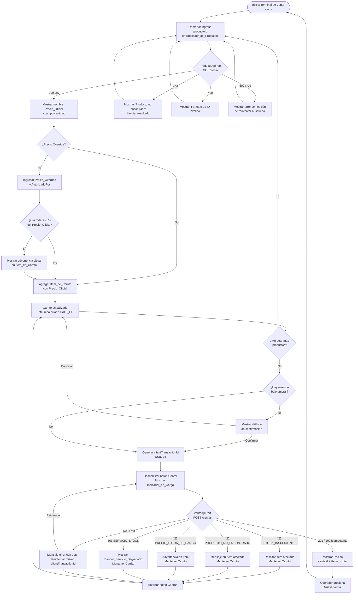

# Documento de Requerimientos — POS Frontend

## Introducción

Este documento especifica los requerimientos funcionales y de calidad del frontend web del sistema
POS (Point of Sale). El frontend es una aplicación Next.js 14+ con App Router que expone una
terminal de venta en el navegador y se comunica con el backend POS a través de los contratos de
API ya definidos.

**Propósito:** Proveer una interfaz de usuario production-ready que permita a los operadores de
caja registrar ventas, consultar precios, gestionar el carrito de compras y manejar errores de
forma clara y recuperable.

**Alcance:** El frontend cubre exclusivamente la capa de presentación e interacción del sistema
POS. No incluye lógica de inventario, autenticación de usuarios ni reportes; esas
responsabilidades pertenecen a otros módulos del backend.

**Relación con el backend:** El frontend consume dos endpoints REST del backend POS:
- `POST /api/v1/ventas` — para registrar una venta completa.
- `GET /api/v1/productos/{productoId}/precio` — para consultar el precio oficial de un producto.

Toda la lógica de negocio del carrito (cálculo de subtotales, totales, validaciones de precio
override) reside en la capa de dominio del frontend y no depende de llamadas de red.

---

## Glosario

- **Terminal_de_Venta**: Pantalla principal de la aplicación donde el operador registra los
  productos y ejecuta el cobro.
- **Carrito**: Estructura de datos en memoria que contiene los ítems seleccionados para una venta,
  sus cantidades, precios aplicados y el total calculado.
- **Ítem_de_Carrito**: Unidad dentro del Carrito que representa un producto con su cantidad,
  precio unitario oficial y, opcionalmente, un precio override.
- **Producto**: Entidad identificada por un `productoId` (ej. `PROD-001`) con un precio unitario
  oficial devuelto por el backend.
- **Precio_Oficial**: Precio unitario vigente de un producto según el backend
  (`GET /api/v1/productos/{productoId}/precio`).
- **Precio_Override**: Precio unitario alternativo ingresado manualmente por el operador para un
  ítem específico, que reemplaza al Precio_Oficial en el cálculo del subtotal.
- **Precio_Aplicado**: Precio unitario efectivamente usado para calcular el subtotal de un
  Ítem_de_Carrito. Es el Precio_Override si fue ingresado; de lo contrario, es el Precio_Oficial.
- **Umbral_de_Descuento**: 70 % del Precio_Oficial de un producto. Si el Precio_Override es
  inferior a este umbral, se requiere confirmación explícita del operador.
- **AutorizadoPor**: Identificador del usuario supervisor que autoriza un Precio_Override. Campo
  obligatorio cuando se ingresa un Precio_Override.
- **clientTransactionId**: UUID v4 generado por el frontend al iniciar un cobro. Identifica de
  forma única la transacción y permite idempotencia en reintentos.
- **Venta**: Resultado exitoso del procesamiento de un Carrito por el backend, identificado por
  `ventaId`.
- **Recibo**: Pantalla de confirmación mostrada al operador tras una Venta exitosa, con el resumen
  de ítems, total y `ventaId`.
- **Redondeo_HALF_UP**: Estrategia de redondeo donde 0.5 se redondea hacia arriba. Aplicada a
  todos los cálculos monetarios del Carrito con precisión de 2 decimales.
- **VentaApiPort**: Interfaz de dominio que abstrae el envío de una venta al backend.
- **ProductoApiPort**: Interfaz de dominio que abstrae la consulta de precio de un producto.
- **CartStoragePort**: Interfaz de dominio que abstrae la persistencia local del Carrito.
- **Adaptador_HTTP**: Implementación concreta de VentaApiPort y ProductoApiPort que usa `fetch`
  para comunicarse con el backend.
- **Servicio_Degradado**: Estado de la aplicación en que el servicio de stock del backend no está
  disponible (error 503), pero el frontend sigue operativo para otras acciones.
- **Buscador_de_Productos**: Componente de la Terminal_de_Venta que acepta un `productoId` y
  dispara la consulta de precio al backend.
- **Indicador_de_Carga**: Elemento visual que informa al operador que una operación asíncrona
  está en curso.
- **Banner_de_Servicio_Degradado**: Elemento visual persistente que informa al operador que el
  servicio de stock no está disponible.
- **DIP**: Principio de Inversión de Dependencias. Los componentes React y los casos de uso
  dependen de interfaces (puertos), no de implementaciones concretas.
- **SSR_Fallback**: Comportamiento del servidor Next.js cuando el backend no responde durante el
  renderizado en servidor; la página se sirve con estado vacío en lugar de lanzar un error.

---

## Requerimientos

---

### Requerimiento 1: Gestión del Carrito

**User Story:** Como operador de caja, quiero agregar, modificar y eliminar productos en el
carrito y ver el total actualizado en tiempo real, para preparar correctamente una venta antes de
cobrar.

#### Criterios de Aceptación

1. WHEN el operador agrega un producto al Carrito, THE Carrito SHALL incluir un Ítem_de_Carrito
   con el `productoId`, la cantidad indicada y el Precio_Oficial obtenido del backend.

2. WHEN el operador agrega al Carrito un producto cuyo `productoId` ya existe en el Carrito, THE
   Carrito SHALL incrementar la cantidad del Ítem_de_Carrito existente en lugar de crear un
   duplicado.

3. WHEN el operador modifica la cantidad de un Ítem_de_Carrito a un valor mayor que cero, THE
   Carrito SHALL actualizar la cantidad y recalcular el subtotal de ese ítem.

4. WHEN el operador modifica la cantidad de un Ítem_de_Carrito a cero, THE Carrito SHALL eliminar
   ese Ítem_de_Carrito del Carrito.

5. WHEN el operador elimina explícitamente un Ítem_de_Carrito, THE Carrito SHALL remover ese ítem
   y recalcular el total.

6. THE Carrito SHALL calcular el subtotal de cada Ítem_de_Carrito como
   `Precio_Aplicado × cantidad`, redondeado con Redondeo_HALF_UP a 2 decimales.

7. THE Carrito SHALL calcular el total de la venta como la suma de todos los subtotales de los
   Ítem_de_Carrito, redondeado con Redondeo_HALF_UP a 2 decimales.

8. WHILE el Carrito contiene al menos un Ítem_de_Carrito, THE Terminal_de_Venta SHALL mostrar el
   total actualizado de forma sincrónica tras cada modificación, sin requerir acción adicional del
   operador.

9. WHEN el operador inicia una Nueva Venta tras un Recibo, THE Carrito SHALL vaciarse
   completamente y el total SHALL mostrarse en cero.

10. THE Carrito SHALL preservar su estado durante recargas de página mediante CartStoragePort,
    de modo que el operador no pierda ítems por una recarga accidental.

11. IF el Carrito está vacío, THEN THE Terminal_de_Venta SHALL deshabilitar el botón "Cobrar".

---

### Requerimiento 2: Búsqueda y Consulta de Precio

**User Story:** Como operador de caja, quiero buscar un producto por su ID y ver su precio
oficial de forma inmediata, para agregar ítems al carrito con el precio correcto.

#### Criterios de Aceptación

1. WHEN el operador ingresa un `productoId` en el Buscador_de_Productos y confirma la búsqueda,
   THE Buscador_de_Productos SHALL invocar ProductoApiPort para obtener el Precio_Oficial del
   producto.

2. WHILE la consulta de precio está en curso, THE Buscador_de_Productos SHALL mostrar el
   Indicador_de_Carga y deshabilitar el campo de búsqueda para evitar envíos duplicados.

3. WHEN ProductoApiPort devuelve una respuesta exitosa, THE Buscador_de_Productos SHALL mostrar
   el nombre del producto, el Precio_Oficial y un campo de cantidad con valor predeterminado 1.

4. WHEN ProductoApiPort devuelve un error 404, THE Buscador_de_Productos SHALL mostrar el mensaje
   "Producto no encontrado" junto al campo de búsqueda y SHALL limpiar cualquier resultado previo.

5. WHEN ProductoApiPort devuelve un error 400, THE Buscador_de_Productos SHALL mostrar el mensaje
   "Formato de ID inválido" junto al campo de búsqueda.

6. IF ProductoApiPort devuelve un error 500 o un error de red, THEN THE Buscador_de_Productos
   SHALL mostrar el mensaje "Error al consultar precio. Intente nuevamente." y SHALL habilitar el
   campo de búsqueda para que el operador pueda reintentar.

7. WHEN el operador confirma la adición del producto mostrado en el Buscador_de_Productos, THE
   Terminal_de_Venta SHALL agregar el Ítem_de_Carrito al Carrito y SHALL limpiar el
   Buscador_de_Productos para una nueva búsqueda.

8. THE Buscador_de_Productos SHALL aceptar únicamente `productoId` con formato alfanumérico
   (letras, dígitos y guiones), y SHALL mostrar un error de validación local sin llamar al backend
   si el formato no es válido.

---

### Requerimiento 3: Proceso de Cobro

**User Story:** Como operador de caja, quiero ejecutar el cobro del carrito con un solo clic y
recibir confirmación inmediata, para cerrar la venta de forma segura y sin duplicados.

#### Criterios de Aceptación

1. WHEN el operador presiona el botón "Cobrar", THE Terminal_de_Venta SHALL generar un
   `clientTransactionId` UUID v4 único para esa transacción antes de enviar la solicitud al
   backend.

2. WHEN el operador presiona el botón "Cobrar", THE Terminal_de_Venta SHALL deshabilitar el botón
   "Cobrar" de forma inmediata y SHALL mostrar el Indicador_de_Carga hasta recibir respuesta del
   backend.

3. THE Terminal_de_Venta SHALL enviar el `clientTransactionId` generado en el mismo intento de
   cobro en todos los reintentos de esa transacción, para garantizar idempotencia.

4. WHEN VentaApiPort devuelve una respuesta 201, THE Terminal_de_Venta SHALL navegar a la pantalla
   de Recibo mostrando el `ventaId`, la lista de ítems con cantidades y precios aplicados, y el
   `totalVenta`.

5. WHEN VentaApiPort devuelve una respuesta 200 para un `clientTransactionId` ya procesado, THE
   Terminal_de_Venta SHALL tratar la respuesta como exitosa y SHALL mostrar el Recibo con los
   datos devueltos.

6. WHEN el Recibo está visible, THE Terminal_de_Venta SHALL mostrar el botón "Nueva Venta" que,
   al ser presionado, vacía el Carrito y regresa a la Terminal_de_Venta lista para operar.

7. IF el operador presiona "Cobrar" y el botón ya está deshabilitado, THEN THE Terminal_de_Venta
   SHALL ignorar el evento de clic sin enviar una segunda solicitud al backend.

8. WHILE el cobro está en proceso, THE Terminal_de_Venta SHALL mantener visible el contenido del
   Carrito para que el operador pueda verificar los ítems.

---

### Requerimiento 4: Precio Override y Descuentos Manuales

**User Story:** Como operador de caja, quiero ingresar un precio alternativo para un ítem con
autorización de un supervisor, para aplicar descuentos manuales de forma controlada y auditable.

#### Criterios de Aceptación

1. THE Terminal_de_Venta SHALL mostrar un campo opcional de Precio_Override por cada
   Ítem_de_Carrito, visible pero no obligatorio por defecto.

2. WHEN el operador ingresa un Precio_Override en un Ítem_de_Carrito, THE Terminal_de_Venta SHALL
   mostrar el campo AutorizadoPor como obligatorio para ese ítem.

3. IF el operador intenta cobrar con un Precio_Override ingresado y el campo AutorizadoPor está
   vacío, THEN THE Terminal_de_Venta SHALL bloquear el envío y SHALL mostrar el mensaje "Se
   requiere autorización para el precio modificado" junto al campo AutorizadoPor del ítem
   afectado.

4. WHEN el operador ingresa un Precio_Override menor al Umbral_de_Descuento del producto, THE
   Terminal_de_Venta SHALL mostrar una advertencia visual destacada en el Ítem_de_Carrito
   indicando que el precio está por debajo del 70 % del Precio_Oficial.

5. WHEN el operador intenta cobrar con al menos un Precio_Override inferior al
   Umbral_de_Descuento, THE Terminal_de_Venta SHALL mostrar un diálogo de confirmación que liste
   los ítems afectados con sus precios y SHALL requerir confirmación explícita antes de enviar la
   solicitud al backend.

6. WHEN el operador confirma el diálogo de descuento, THE Terminal_de_Venta SHALL proceder con el
   cobro incluyendo los Precio_Override y los valores AutorizadoPor en el cuerpo de la solicitud
   a VentaApiPort.

7. WHEN el operador cancela el diálogo de descuento, THE Terminal_de_Venta SHALL regresar a la
   Terminal_de_Venta con el Carrito intacto sin enviar ninguna solicitud al backend.

8. THE Carrito SHALL usar el Precio_Override como Precio_Aplicado en el cálculo del subtotal del
   ítem cuando el Precio_Override esté presente y sea mayor que cero.

9. IF el operador ingresa un Precio_Override igual a cero o negativo, THEN THE Terminal_de_Venta
   SHALL mostrar el mensaje "El precio override debe ser mayor que cero" y SHALL bloquear el
   envío.

---

### Requerimiento 5: Manejo de Errores en la Interfaz

**User Story:** Como operador de caja, quiero recibir mensajes de error claros y específicos ante
cualquier fallo del backend, para entender qué ocurrió y poder actuar sin perder el trabajo
realizado.

#### Criterios de Aceptación

1. WHEN VentaApiPort devuelve un error 422 con código `STOCK_INSUFICIENTE`, THE Terminal_de_Venta
   SHALL resaltar visualmente el Ítem_de_Carrito afectado, SHALL mostrar el mensaje "Stock
   insuficiente para [productoId]" junto a ese ítem y SHALL mantener el Carrito completo para que
   el operador pueda ajustar la cantidad.

2. WHEN VentaApiPort devuelve un error 422 con código `PRODUCTO_NO_ENCONTRADO`, THE
   Terminal_de_Venta SHALL mostrar el mensaje "Producto [productoId] no encontrado en el sistema"
   junto al ítem afectado y SHALL mantener el Carrito intacto.

3. WHEN VentaApiPort devuelve un error 422 con código `PRECIO_FUERA_DE_RANGO`, THE
   Terminal_de_Venta SHALL mostrar una advertencia en el Ítem_de_Carrito afectado indicando que
   el precio override está fuera del rango permitido por el backend y SHALL mantener el Carrito
   intacto.

4. WHEN VentaApiPort devuelve un error 503 con código `SERVICIO_STOCK_NO_DISPONIBLE`, THE
   Terminal_de_Venta SHALL mostrar el Banner_de_Servicio_Degradado con el mensaje "Servicio de
   stock no disponible. Contacte al administrador." y SHALL mantener el Carrito intacto.

5. IF VentaApiPort devuelve un error 500 con código `ERROR_PERSISTENCIA` o un error de red, THEN
   THE Terminal_de_Venta SHALL mostrar el mensaje "Error al procesar la venta. Puede reintentar
   de forma segura." con un botón "Reintentar" que reenvíe la solicitud usando el mismo
   `clientTransactionId`.

6. WHEN el operador presiona "Reintentar" tras un error 500 o de red, THE Terminal_de_Venta SHALL
   reutilizar el `clientTransactionId` original de esa transacción para garantizar idempotencia
   en el reintento.

7. WHEN VentaApiPort devuelve un error 400, THE Terminal_de_Venta SHALL mostrar el mensaje
   "Solicitud inválida. Revise los datos del carrito." y SHALL habilitar la edición del Carrito.

8. THE Terminal_de_Venta SHALL habilitar el botón "Cobrar" nuevamente tras cualquier error de
   cobro, para que el operador pueda corregir y reintentar.

9. IF el Banner_de_Servicio_Degradado está visible y VentaApiPort devuelve una respuesta exitosa
   en un reintento, THEN THE Terminal_de_Venta SHALL ocultar el Banner_de_Servicio_Degradado
   automáticamente.

10. THE Terminal_de_Venta SHALL preservar el `clientTransactionId` generado para una transacción
    fallida durante toda la sesión de reintento, hasta que el operador inicie una Nueva Venta.

---

### Requerimiento 6: Arquitectura Hexagonal y Principios SOLID en el Frontend

**User Story:** Como desarrollador del equipo, quiero que el frontend siga arquitectura hexagonal
y principios SOLID, para que la lógica de negocio sea testeable de forma aislada y los adaptadores
sean intercambiables sin modificar el dominio.

#### Criterios de Aceptación

1. THE Sistema SHALL definir VentaApiPort como una interfaz TypeScript pura en `src/domain/` que
   declare el método de envío de venta sin ninguna referencia a `fetch`, `axios` ni a módulos de
   React o Next.js.

2. THE Sistema SHALL definir ProductoApiPort como una interfaz TypeScript pura en `src/domain/`
   que declare el método de consulta de precio sin ninguna referencia a implementaciones de red.

3. THE Sistema SHALL definir CartStoragePort como una interfaz TypeScript pura en `src/domain/`
   que declare los métodos de lectura y escritura del Carrito sin ninguna referencia a
   `localStorage` ni a APIs del navegador.

4. THE Sistema SHALL implementar Adaptador_HTTP en `src/adapters/out/` como la única clase que
   contiene llamadas `fetch` al backend, implementando VentaApiPort y ProductoApiPort.

5. THE Sistema SHALL inyectar las implementaciones concretas de los puertos en los casos de uso
   y componentes a través de parámetros o contexto React, de modo que ningún componente en
   `src/adapters/in/` importe directamente el Adaptador_HTTP.

6. THE Sistema SHALL ubicar toda la lógica de cálculo del Carrito (subtotales, total,
   Redondeo_HALF_UP, deduplicación) en funciones puras dentro de `src/domain/`, sin dependencias
   de React ni de Next.js.

7. THE Sistema SHALL organizar los casos de uso como hooks o funciones puras en
   `src/application/`, donde cada caso de uso dependa únicamente de interfaces de puertos y de
   funciones del dominio.

8. IF el backend no responde durante el renderizado en servidor (SSR) de Next.js, THEN THE
   Sistema SHALL servir la página con un Carrito vacío y estado inicial en lugar de lanzar una
   excepción no controlada que interrumpa la respuesta HTTP.

9. THE Sistema SHALL compilar sin errores con `typescript strict: true`, sin uso de `any` implícito
   ni supresión de errores de tipo mediante comentarios `@ts-ignore`.

10. WHERE se requiera reemplazar el Adaptador_HTTP por un adaptador simulado en tests, THE Sistema
    SHALL permitir la sustitución sin modificar ningún archivo fuera de `src/adapters/out/` ni
    de la configuración de inyección de dependencias.

---

### Requerimiento 7: Tests con Property-Based Testing (fast-check)

**User Story:** Como desarrollador del equipo, quiero una suite de tests que incluya pruebas
basadas en propiedades con fast-check para la lógica crítica del dominio, para detectar casos
borde que los tests de ejemplo no cubren.

#### Criterios de Aceptación

1. THE Suite_de_Tests SHALL incluir una propiedad que verifique que el total del Carrito es
   siempre igual a la suma de los subtotales individuales de todos los Ítem_de_Carrito, para
   cualquier combinación arbitraria de ítems generada por fast-check.

2. THE Suite_de_Tests SHALL incluir una propiedad que verifique que calcular el total del Carrito
   dos veces sobre el mismo estado produce el mismo resultado (idempotencia del cálculo), para
   cualquier estado de Carrito generado por fast-check.

3. THE Suite_de_Tests SHALL incluir una propiedad que verifique que el Umbral_de_Descuento de
   cualquier producto es siempre exactamente el 70 % del Precio_Oficial, redondeado con
   Redondeo_HALF_UP a 2 decimales, para cualquier precio generado por fast-check.

4. THE Suite_de_Tests SHALL incluir una propiedad que verifique que el Redondeo_HALF_UP aplicado
   a subtotales y totales nunca produce un valor con más de 2 decimales, para cualquier
   combinación de precio y cantidad generada por fast-check.

5. THE Suite_de_Tests SHALL incluir una propiedad que verifique que agregar el mismo producto dos
   veces al Carrito produce un único Ítem_de_Carrito con la cantidad sumada (invariante de
   deduplicación), para cualquier par de cantidades generado por fast-check.

6. THE Suite_de_Tests SHALL incluir una propiedad que verifique que el total del Carrito es
   siempre mayor o igual a cero para cualquier estado de Carrito con precios y cantidades
   positivos generado por fast-check.

7. THE Suite_de_Tests SHALL incluir tests de ejemplo (no property-based) para cada código de
   error del backend (STOCK_INSUFICIENTE, PRODUCTO_NO_ENCONTRADO, PRECIO_FUERA_DE_RANGO,
   SERVICIO_STOCK_NO_DISPONIBLE, ERROR_PERSISTENCIA) verificando que el componente muestra el
   mensaje correcto y el estado del Carrito no se modifica.

8. THE Suite_de_Tests SHALL ejecutarse con Vitest en modo `--run` (ejecución única, sin modo
   watch) y SHALL completar sin errores ni warnings de tipo TypeScript.

9. WHERE se usen adaptadores simulados en los tests de casos de uso, THE Suite_de_Tests SHALL
   implementar los simulados como objetos que implementan los puertos del dominio, sin usar
   librerías de mocking que generen tipos `any`.

---

## Diagrama de Flujo — Ciclo Completo de una Venta

