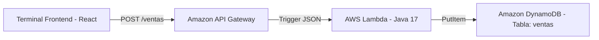

# 🛒 Sistema POS Universitario


Proyecto universitario de Arquitectura de Software y Cómputo en la Nube: Un sistema de Punto de Venta (POS) y facturación modular, implementando una terminal web en el frontend y una arquitectura de **Microservicios Serverless** en el backend sobre **Amazon Web Services (AWS)**.

---

## 📂 Estructura del Repositorio

El proyecto está dividido en dos microservicios independientes que garantizan alta escalabilidad y desacoplamiento:

*   **`pos-frontend/`**: Aplicación web del cajero (Terminal POS) construida con React, TypeScript y Zustand. Cuenta con atajos de teclado del cajero (`F2`, `F3`, `F4`), buscador con autocompletado y cálculo automático de IVA y cambio.
*   **`pos-backend/`**: Backend Serverless construido en **Java 17** para ejecutarse sobre **AWS Lambda**, exponiendo endpoints REST a través de **AWS API Gateway** y persistiendo las transacciones de forma segura en **AWS DynamoDB**.
    *   `src/main/java/com/pos/handlers/CrearVentaHandler.java`: Manejador de la función Lambda que procesa y registra las ventas en la nube.
    *   `infraestructura/template.yml`: Plantilla de Infraestructura como Código (IaC) escrita para **AWS SAM (Serverless Application Model)**.

---

## ☁️ Arquitectura Serverless en AWS

El backend ha sido reestructurado para migrar de una arquitectura local tradicional a una solución moderna sin servidores en la nube:



### 🔀 Migración Tecnológica: De XAMPP (Local) a AWS DynamoDB (Nube)
En arquitecturas tradicionales se suele utilizar **XAMPP** para inicializar bases de datos relacionales locales (MySQL). Para este diseño moderno de nube, **hemos migrado a una base de datos NoSQL nativa de la nube (Amazon DynamoDB)**:
*   **Sin servidores (Serverless):** No requieres iniciar servicios locales de Apache o MySQL con XAMPP. La base de datos vive directamente en la infraestructura elástica de AWS, disponible en cualquier momento.
*   **Velocidad de Caja Registradora:** DynamoDB procesa operaciones de lectura y escritura en milisegundos de un solo dígito, garantizando facturación instantánea.
*   **Microservicios Desacoplados:** Cada servicio tiene su propia tabla NoSQL independiente con claves de partición optimizadas (`ventaId` y `productoId`).

---

## 📸 Evidencias de Despliegue en AWS (Capturas de Pantalla)

> [!NOTE]
> *Espacio reservado para las capturas del reporte del proyecto. Agrega tus imágenes en las rutas correspondientes:*

### 1. Configuración de Seguridad (AWS IAM)
*Sección que muestra el usuario programático `dev-sebastian` creado con las políticas de permisos `AmazonDynamoDBFullAccess`, `AWSLambda_FullAccess` y `AmazonAPIGatewayAdministrator`.*

`[Arrastra tu captura de IAM aquí o reemplaza esta línea con: ]`

### 2. Base de Datos NoSQL (AWS DynamoDB)
*Sección que muestra la creación exitosa de las dos tablas (`ventas` y `productos`) con sus respectivas claves de partición en estado Activo.*

`[Arrastra tu captura de DynamoDB aquí o reemplaza esta línea con: ]`

### 3. Capa de Red y API (AWS API Gateway)
*Sección que muestra el Endpoint de red expuesto `/ventas` con el método HTTP `POST` configurado como disparador de la función Lambda.*

`[Arrastra tu captura de API Gateway aquí o reemplaza esta línea con: ]`

---

## 🛠️ Cómo Compilar y Desplegar el Backend

### Prerrequisitos
1.  **Java JDK 17 o superior** instalado y configurado en el sistema.
2.  **AWS CLI** configurado localmente con las llaves de acceso de tu usuario IAM (`aws configure`).
3.  **AWS SAM CLI** instalado para gestionar el empaquetado y despliegue del YAML.

### Paso 1: Compilar el proyecto Java
Entra a la carpeta del backend y ejecuta el comando de construcción (se incluye un entorno local portable para que no requieras configuraciones complejas de variables de entorno):
```bash
cd pos-backend
./apache-maven-3.9.6/bin/mvn.cmd clean package
```
Esto generará un archivo "Fat-Jar" optimizado en `pos-backend/target/pos-backend-1.0.0.jar` que contiene todo el código compilado junto con el SDK de AWS DynamoDB.

### Paso 2: Desplegar en la Nube con AWS SAM
Desde la carpeta del backend, inicializa el asistente de despliegue interactivo de SAM:
```bash
sam deploy --guided
```
Sigue el asistente indicando el nombre de la pila (ej. `pos-supermarket-stack`) y la región de AWS (ej. `us-east-1`). El sistema leerá la plantilla `infraestructura/template.yml`, aprovisionará las tablas DynamoDB automáticamente, configurará el API Gateway y subirá la función Lambda compilada a la nube.

---

## 🚀 Cómo Arrancar el Proyecto Localmente (Windows)

Para ejecutar todo el ecosistema (Base de Datos Local, Backend API y Frontend React), debes abrir **terminales de PowerShell independientes** y ejecutar los siguientes comandos en orden:

### 1️⃣ Terminal 1: Base de Datos (DynamoDB Local)
Inicializa el motor NoSQL en memoria (puerto `8000`):
```powershell
cd pos-backend\scripts
powershell -ExecutionPolicy Bypass -File .\1-iniciar-dynamodb-local.ps1
```
*👉 Mantén esta terminal abierta.*

### 2️⃣ Terminal 2: Crear Tablas e Inventario Semilla
Genera las tablas `ventas` y `productos` y carga los datos de prueba en la base de datos local:
```powershell
cd pos-backend\scripts
powershell -ExecutionPolicy Bypass -File .\2-crear-tablas.ps1
```
*👉 Este script creará las tablas y finalizará solo. Puedes cerrar la terminal al terminar.*

### 3️⃣ Terminal 3: Servidor Backend (API en Puerto 3000)
Compila el proyecto Java y expone los endpoints HTTP locales para el frontend:
```powershell
cd pos-backend\scripts
powershell -ExecutionPolicy Bypass -File .\5-iniciar-api-local.ps1
```
*👉 Mantén esta terminal abierta.*

### 4️⃣ Terminal 4: Terminal POS (Frontend React en Puerto 5173)
Levanta la interfaz web de cajero (Vite + React) donde opera el escáner global y el simulador interactivo:
```bash
cd pos-frontend
npm install
npm run dev
```
*👉 Abre en tu navegador **`http://localhost:5173`**.*

---
*Desarrollado para la entrega final de Arquitectura de Software y Sistemas Distribuidos.*

<<<<<<< HEAD
---

## 📐 Proceso SDD (Spec-Driven Development)

El desarrollo de este backend se rigió rigurosamente bajo el enfoque **Spec-Driven Development (SDD)**, estructurando el trabajo en las siguientes fases consecutivas:

1. **Definición de Especificaciones (.kiro/specs/):** Antes de programar, se establecieron en la carpeta `.kiro/specs/pos-api/` los requisitos funcionales (`requirements.md`), decisiones de diseño (`design.md`) y el backlog técnico secuencial (`tasks.md`).
2. **Implementación Guiada por Tareas:** Cada componente del código (desde los Value Objects y el Validator, hasta los Handlers de AWS Lambda y la configuración en `template.yml`) se implementó siguiendo en orden estricto el backlog de tareas de especificación ya aprobado.
3. **Validación y Pruebas:** Los criterios de aceptación especificados previamente en `requirements.md` sirvieron de base directa para escribir las pruebas unitarias mockeadas con JUnit 5 y Mockito, garantizando cobertura ante respuestas exitosas, validaciones y errores de infraestructura.

Esta disciplina previno errores de diseño y permitió modularizar el backend en una arquitectura hexagonal limpia y 100% trazable a la documentación.

---

## 🧪 Pruebas Unitarias

Se cuenta con cobertura de pruebas unitarias robustas que aíslan la capa de datos de DynamoDB utilizando Mockito. Las pruebas cubren escenarios de respuesta exitosa (201), validaciones de campos requeridos (400) y excepciones de infraestructura simulando fallas en DynamoDB (500).

`[Arrastra tu captura de la terminal corriendo 'mvn test' exitosamente aquí o reemplaza esta línea con: ]`

---

## 🌐 URL Base de API Gateway Desplegada

Una vez desplegada en AWS mediante SAM, el API Gateway expone la siguiente ruta base en la nube:

*   **URL Base API:** `https://<api-id>.execute-api.<region>.amazonaws.com/Prod`
    *   `GET /productos` - Obtiene la lista de productos
    *   `POST /ventas` - Registra una venta

=======
>>>>>>> f1e36cb0c4a7c8c1d781464c77d337f158853e9f
