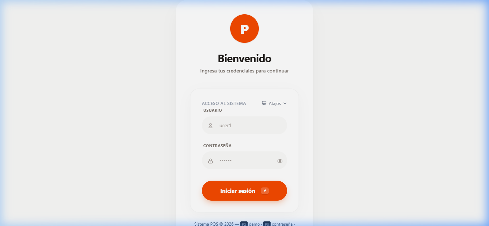
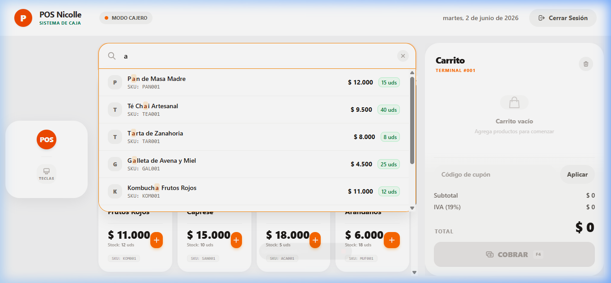
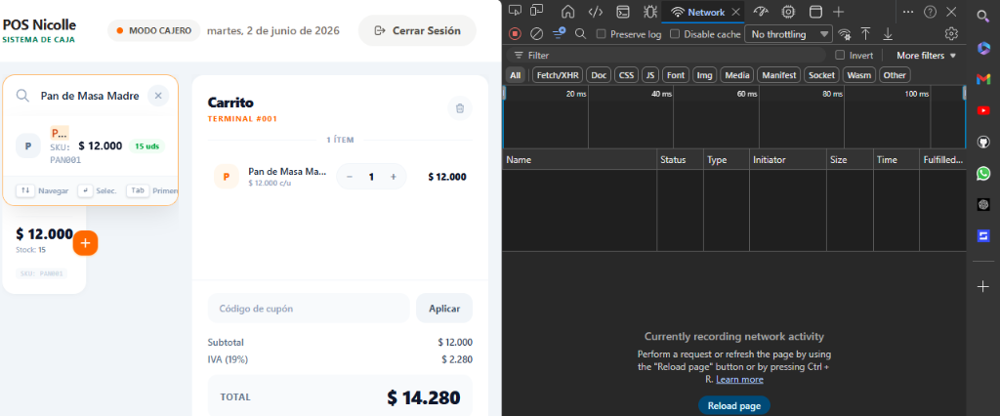

# 🛒 Sistema POS Web Premium (Spec-Driven Development)


Sistema de Punto de Venta (POS) web diseñado bajo la metodología **Spec-Driven Development (SDD)**. La solución adopta un enfoque desacoplado, estructurado en capas limpias y asíncronas para proveer latencias bajas y una experiencia de caja registradora altamente interactiva.

---

## 🏗️ Arquitectura del Sistema

El proyecto implementa una arquitectura de microservicios y SPAs desacopladas que se comunican mediante HTTP/REST con las siguientes particularidades técnicas:

### 1. Frontend (SPA)
*   **Framework**: React 18+ (inicializado bajo Vite para bundling ultra rápido).
*   **Arquitectura de Software**: Estructuración por componentes funcionales altamente modularizados y orientados a dominios (`features/pos/`).
*   **Gestión de Estado**: Implementación de **Zustand** como almacén de estado ligero, eludiendo la sobrecarga de re-renders masivos del Context API de React. Esto garantiza que las mutaciones sobre el carrito e inventario ocurran de manera atómica e instantánea.
*   **Estrategia de Estilos**: CSS Vanilla encapsulado con variables CSS semánticas de última generación, incorporando desenfoques de fondo (Glassmorphism), transiciones aceleradas por hardware y esquemas oscuros armónicos.

### 2. Backend (Java / Spring Boot)
*   **Arquitectura Limpia (Hexagonal)**: División en tres capas bien delimitadas:
    *   **Domain**: Entidades puras y reglas de negocio sin dependencias externas.
    *   **Application**: Puertos e interfaces que dictan los casos de uso (procesamiento de ventas, búsqueda).
    *   **Infrastructure**: Adaptadores primarios (endpoints REST) y secundarios (persistencia en base de datos local y DynamoDB).
*   **Integración Asíncrona**: Búsquedas dinámicas optimizadas que interconectan la interfaz del cajero en tiempo real con el endpoint `GET /api/products/search?q={query}` mediante peticiones de red transparentes y visibles en el inspector (pestaña Network).

---

## 🚀 Metodología SDD (Spec-Driven Development)

Antes de codificar, se especificaron y estructuraron los requerimientos técnicos y esquemas de diseño dentro del directorio `.kiro/specs/pos-frontend/`:
- **`requirements.md`**: Definición rigurosa de flujos de negocio (autenticación, venta, validación y gestión de stocks) y los contratos REST.
- **`design.md`**: Detalle del layout del sistema (Dock minimalista asimétrico, panel de carrito premium y previsualización de facturas).
- **`tasks.md`**: Checklist técnico secuencial que garantizó un desarrollo ordenado e iterativo.

---

## 💻 Configuración y Despliegue Local

### Requisitos Previos
*   Node.js v18+ y npm
*   JDK 17+ (para el backend en Spring)

### Ejecución del Frontend
```bash
# 1. Acceder al directorio del frontend
cd pos-frontend

# 2. Instalar dependencias del proyecto
npm install

# 3. Lanzar servidor de desarrollo local
npm run dev
```
Por defecto, la interfaz se servirá en `http://localhost:5173`.

### Variables de Entorno
La configuración de conexión con las APIs se maneja a través de un archivo `.env` en la raíz del frontend (`pos-frontend/`):
```env
VITE_API_BASE_URL=http://localhost:8088/api
VITE_SALES_API_URL=http://localhost:8088/api
VITE_STORE_NAME="POS Nicolle"
VITE_TERMINAL_ID="TERM-001"
```

---

## 📸 Evidencias de Funcionamiento

A continuación se presentan los módulos clave del sistema implementados bajo los estándares del proyecto:

### 1. Módulo de Autenticación de Cajero (Login)
*   Interfaz premium centrada con manejo de atajos rápidos de teclado para testing inmediato.
> 

### 2. Panel Principal e Integración del Buscador (`GET /api/products/search`)
*   Campo de texto con búsqueda predictiva conectada a la API que expone peticiones asíncronas HTTP en la consola de inspección.
> 

### 3. Carrito de Compras Premium y Previsualización de Factura
*   Estructura estilizada con barra de progreso, cálculo dinámico de IVA (19%) y totalizadores.
> 
