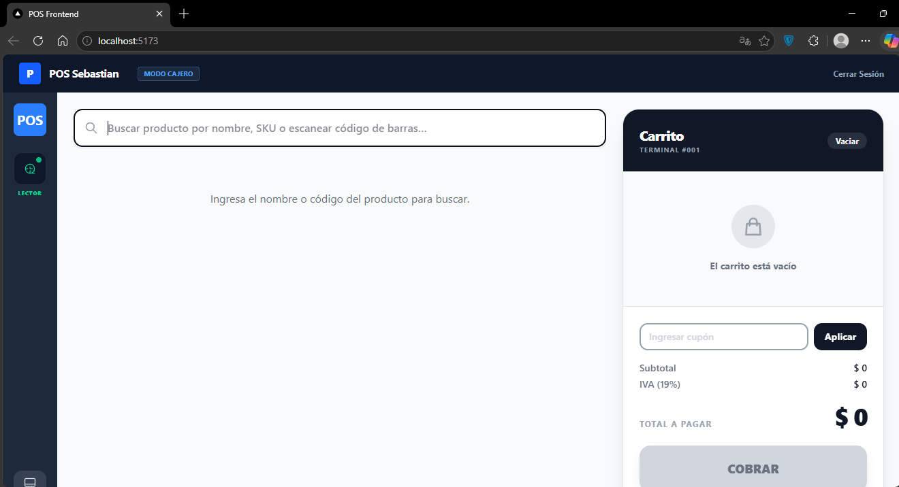
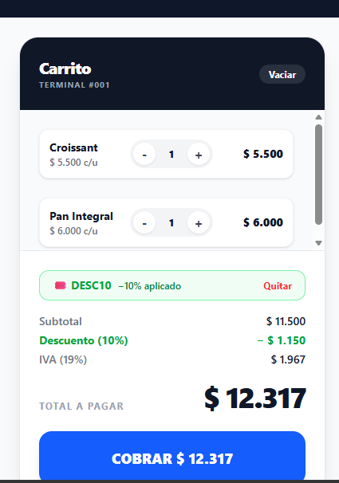
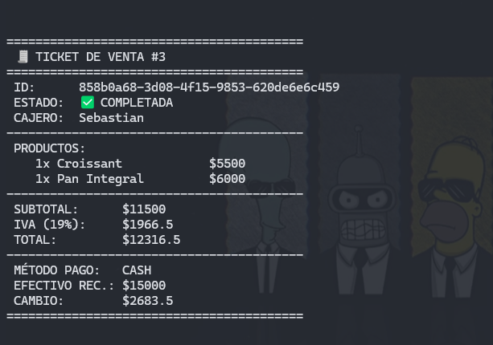

# 🛒 Sistema POS Web (Spec-Driven Development)


Proyecto universitario: Un sistema de Punto de Venta (POS) básico web construido con enfoque **Spec-Driven Development (SDD)**, cumpliendo con los fundamentos de HTML5, CSS (Flexbox/Grid), y JavaScript asíncrono.

---

## 🏗️ Arquitectura Cliente-Servidor y Framework

Este proyecto implementa una arquitectura Cliente-Servidor donde el Frontend (SPA) se comunica mediante peticiones HTTP REST (`fetch`/`axios`) con un Backend remoto.

### Framework Elegido y Justificación
Se ha utilizado **React** (inicializado con **Vite**) para el frontend. 
**¿Por qué React?** 
1. React permite construir interfaces altamente interactivas usando componentes funcionales y **Hooks** (`useState`, `useEffect`), ideal para un flujo de caja (POS) que requiere actualización de estados inmediatos.
2. El manejo del "Virtual DOM" de React asegura que cuando se agrega un ítem al carrito de ventas, solo se re-renderice la lista en pantalla sin recargar la página entera, proporcionando la "velocidad de caja registradora" requerida.
3. Se integró con **Zustand** para la gestión global del estado del carrito, lo que permite una escalabilidad más limpia que pasar *props* manualmente entre componentes.

---

## 🚀 Proceso SDD (Spec-Driven Development)

Siguiendo el enfoque SDD, **antes de escribir cualquier línea de código**, se definieron los specs en la carpeta `.kiro/specs/pos-frontend/`:
- **`requirements.md`**: Definió claramente que necesitábamos consumir `GET /productos` y hacer `POST /ventas`.
- **`design.md`**: Estableció la Arquitectura Hexagonal y la justificación técnica.
- **`tasks.md`**: Nos dio la ruta de implementación, evitando trabajar "a ciegas" y asegurando que las vistas se desarrollaran en orden lógico.

El código resultante es una implementación directa de estos documentos.

---

## 💻 Ejecución Local

Para ejecutar el frontend de este proyecto de forma local, sigue estos pasos:

```bash
# 1. Ingresa a la carpeta del frontend
cd pos-frontend

# 2. Instala las dependencias
npm install

# 3. Inicia el servidor de desarrollo local
npm run dev
```
La aplicación estará disponible en `http://localhost:5173`.

---

## ⚙️ Configuración (Variables de Entorno)

La URL base del API (API Gateway o Local) **no está hardcodeada** en el código fuente. Se configura dinámicamente mediante un archivo `.env` en la carpeta `pos-frontend/`.

Para conectarse al backend, crea (o edita) un archivo `.env` en `pos-frontend/` con el siguiente contenido:

```env
# URL base del API Gateway (Ejemplo para entorno de producción o local)
VITE_API_BASE_URL=http://localhost:8088/api
VITE_SALES_API_URL=http://localhost:8088/api

# Nombre y Terminal de la tienda
VITE_STORE_NAME=Mi Universidad POS
VITE_TERMINAL_ID=TERM-001
```
*(Nota: El código consume esta configuración a través de `import.meta.env.VITE_API_BASE_URL`)*.

---

## 📸 Evidencias de Funcionalidad

A continuación se demuestra el funcionamiento de los flujos principales solicitados:

### 1. Listado de productos cargado desde el API (`GET /productos`)
*(El sistema carga asincrónicamente el catálogo usando la API remota)*

> 

### 2. Registro exitoso de una venta (`POST /ventas`) con respuesta del API visible
*(Flujo de selección de productos, cálculo de totales, envío mediante POST y notificación de éxito)*

> 

### 3. Manejo de un error (API caído o respuesta inválida)
*(El sistema intercepta la excepción `try/catch` y notifica amigablemente al usuario)*

> 
